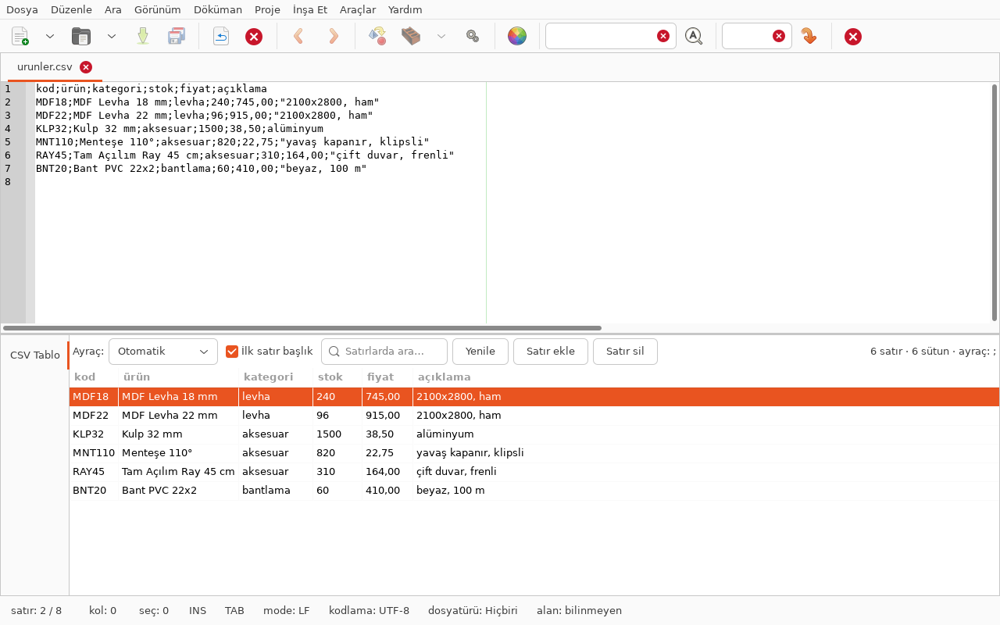

# geany-csv — Geany için CSV tablo eklentisi

Açık `.csv` / `.tsv` belgesini Geany'nin alt panelinde **düzenlenebilir** bir tablo
olarak gösterir. Hücreyi değiştirdiğinizde değişiklik doğrudan editördeki metne
yazılır; metni editörden değiştirdiğinizde tablo kendiliğinden tazelenir.

İş takibi: [TODO.md](TODO.md)



## Ne yapar

- **Ayracı kendisi bulur** — `,` `;` sekme `|` arasından, satır başına düşen alan
  sayısının tutarlılığına bakarak seçer. Araç çubuğundan elle de zorlanabilir.
- **RFC 4180 uyumlu ayrıştırma** — tırnak içindeki ayraç, `""` ile kaçırılmış
  tırnak ve tırnak içinde satır sonu doğru okunur.
- **Hücre düzenleme** — hücreye iki kez tıklayın, yazın, Enter. Değer ayraç,
  tırnak veya satır sonu içeriyorsa dosyaya yazılırken kendiliğinden tırnaklanır.
- **Satır ekle / sil** — yeni satır tablo genişliğinde boş alanlarla açılır.
- **Süzme ve sıralama** — arama kutusu satırları süzer; sütun başlığına tıklamak
  sıralar (sayı gibi görünen değerler sayısal sıralanır).
- **Editörle bağ** — tabloda satır seçince editörde o satıra gidilir.
- Her değişiklik Geany'nin geri alma geçmişine yazılır: **Ctrl+Z** çalışır.

### Neden dosyanın tamamı yeniden yazılmıyor

Bir hücre değiştiğinde yalnız o kaydın bayt aralığı Scintilla hedefiyle
değiştirilir. Böylece dosyanın geri kalanı, imleç konumu ve geri alma geçmişi
olduğu gibi kalır; dokunmadığınız satırların tırnaklama biçimi de bozulmaz.

## Kurulum

```bash
git clone https://github.com/muslu/geany-csv.git
cd geany-csv
make
make install        # ~/.config/geany/plugins/geany-csv.so
```

Sonra Geany → **Araçlar → Eklenti Yöneticisi** → *CSV Tablo* kutusunu işaretleyin.
Panel, ileti penceresinde **CSV Tablo** sekmesi olarak açılır
(**Araçlar → CSV Tablo** sekmeye geçirir).

### Gereksinimler

- Geany ≥ 1.26 (API 225). 1.38 ile geliştirildi ve sınandı.
- Geany eklenti başlıkları: `sudo nala install geany-common`
- GTK 3 geliştirme başlıkları: `sudo nala install libgtk-3-dev`

#### libgtk-3-dev kurulamıyorsa

Bazı sistemlerde `libgtk-3-dev`, harici depolardan gelen daha yeni bir
`libbrotli1` yüzünden kurulamaz (apt, çözüm olarak wine/openjdk gibi paketleri
silmeyi önerir — kabul etmeyin). Bu durumda başlıkları sisteme dokunmadan yerel
bir dizine açın:

```bash
make sdk        # ~/.local/gtk3-sdk içine açar, dpkg'ye dokunmaz
make
```

`make` yerel SDK'yı kendiliğinden bulur; sistemde düzgün bir `libgtk-3-dev`
varsa onu kullanır.

## Ayarlar

**Eklenti Yöneticisi → Tercihler**:

| Ayar | Varsayılan | Ne yapar |
|---|---|---|
| Yazarken tabloyu kendiliğinden güncelle | açık | Editörde yazdıkça tablo tazelenir (400 ms gecikmeli) |
| Tabloda satır seçilince editörde o satıra git | açık | Tablo seçimi editör imlecini taşır |
| En çok gösterilecek satır | 50000 | Yalnız **gösterim** sınırı; belgenin tamamı düzenlenebilir |

Ayraç ve "ilk satır başlık" seçimleri araç çubuğundadır ve kalıcıdır.
Ayarlar `~/.config/geany/plugins/geany-csv/geany-csv.conf` dosyasında tutulur.

### Kısayol tuşu

**Düzenle → Tercihler → Kısayol Tuşları → CSV Tablo** altında iki eylem vardır
(*Göster* ve *Yenile*); varsayılan olarak atanmamıştır.

## Sınırlar

- Sütun ekleme/silme yok — bu işlem her satırı yeniden yazmayı gerektirir.
- Tablo, belgenin kodlamasını değil Geany'nin arabelleğini (UTF-8) okur; dosya
  kodlaması Geany'de nasıl açıldıysa öyle kaydedilir.
- Çok büyük dosyalarda gösterim sınırı devreye girer; süzgeç yine tüm belgede arar.
- Salt okunur belgelerde düzenleme yapılmaz, durum çubuğunda uyarı verilir.

## Geliştirme

```bash
make test       # ayrıştırıcı birim testleri (GTK gerekmez)
make CFLAGS="-O2 -g -Werror"
```

Ayrıştırıcı (`src/csv.c`) Geany'den bağımsızdır ve yalnız GLib kullanır;
testleri arayüz olmadan çalışır. Arayüz ve Geany bağlantısı `src/plugin.c`
içindedir.

## Lisans

GPL-2.0-or-later — Geany eklenti API'si GPL olduğu için zorunludur. Ayrıntı:
[LICENSE](LICENSE).
